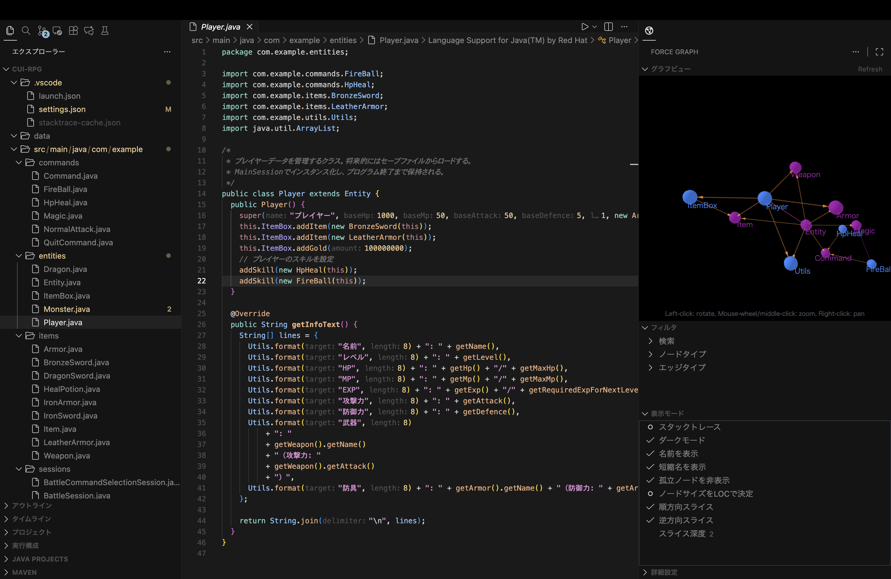

# DependViz

VS Code extension to visualize code dependencies as a force-directed graph.

Javaコードベースの依存関係を力学レイアウトで可視化するVS Code拡張機能です。

Marketplace: https://marketplace.visualstudio.com/items?itemName=myaccount-hash.vscode-force-graph-viewer




## Features

- 2D/3D force-directed graph visualization of Java project dependencies

   2D/3D有向グラフ表示によるJavaプロジェクトの依存関係の可視化
- Search, filters, focus, and slice navigation

   検索、フィルタ、フォーカス、スライス操作

## Usage

1. Open a project in VS Code.

   VS Codeでプロジェクトを開く
2. Open the graph view in the Activity Bar.

   グラフビューをアクティビティバーで開く
3. Press the play button in the top-right of the graph view to run the analysis.

   グラフビュー右上の再生ボタンを押すことで解析を実行．

## Development

Requirements:

- Node.js + npm
- Java + Maven

Build:

```bash
npm run build
```

## TODO

- [ ] Make analysis independent of project Java version

  プロジェクトのJAVAバージョンに依存しない設計にする

- [ ] Add UI for configuring colors by node/edge type

  ノード・エッジ種別ごとの色設定UIの追加

- [ ] Add JavaScript support (implement JavaScriptAnalyzer)

  JavaScriptへの対応(JavaScriptAnalyzerの実装)


## License

MIT
